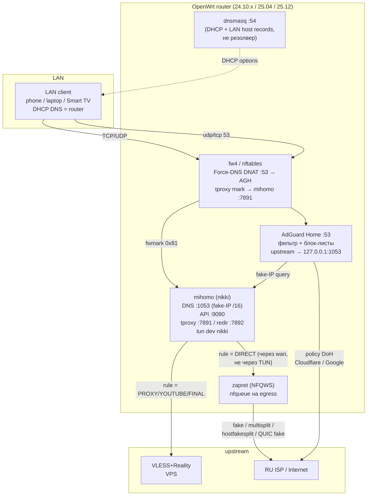
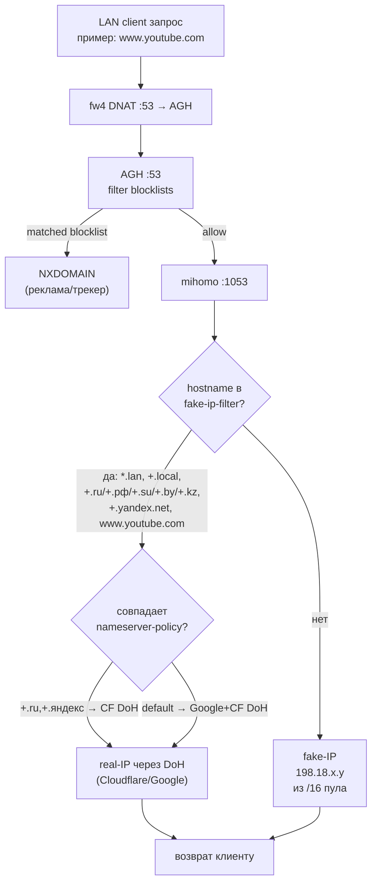
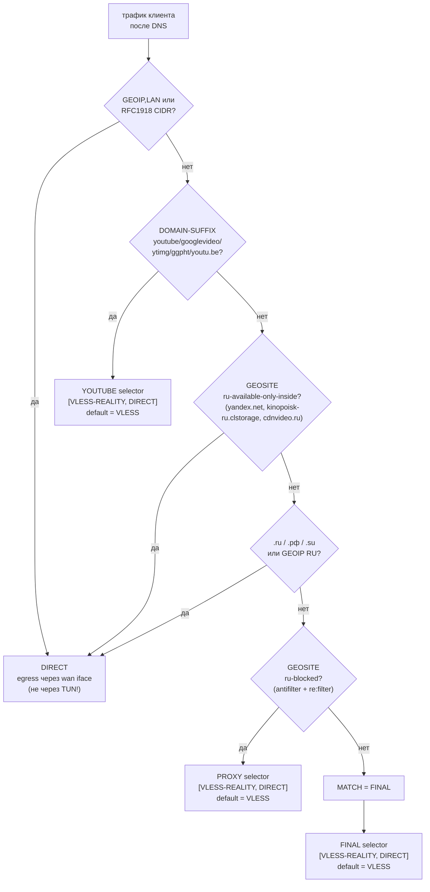
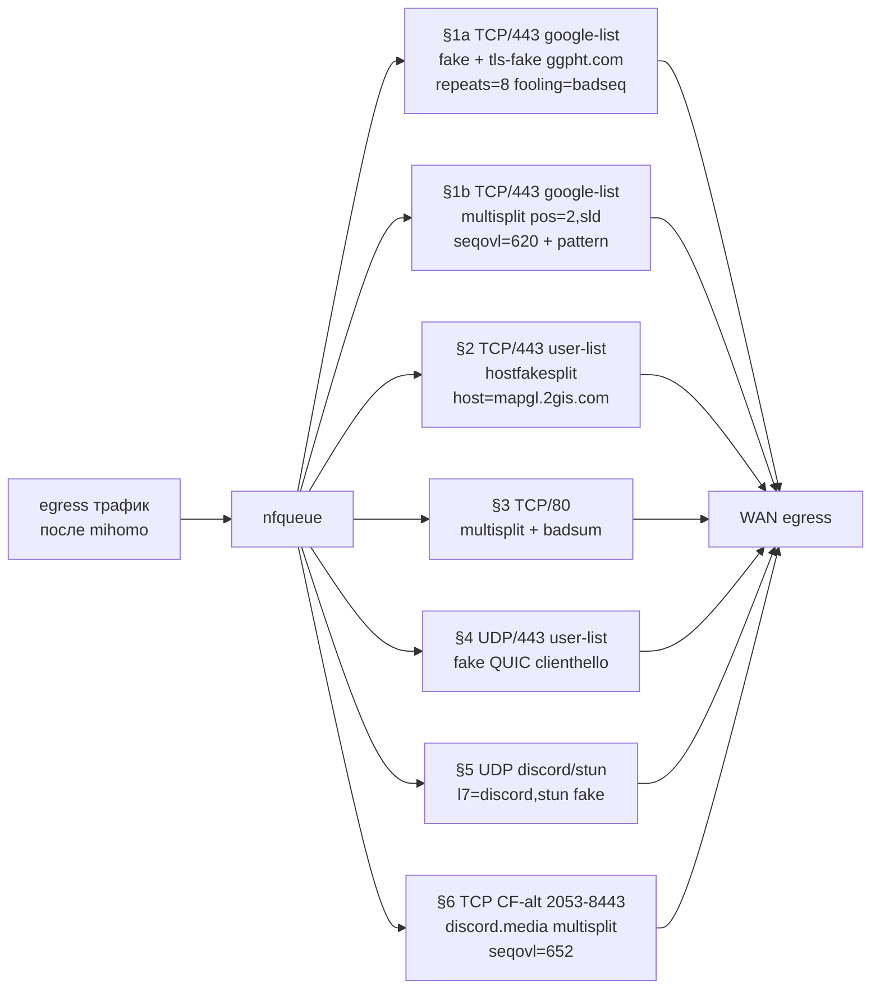
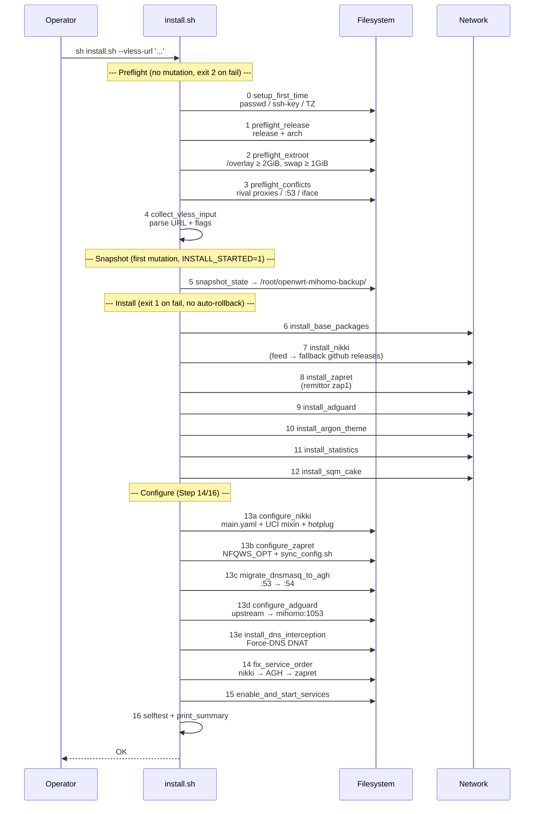
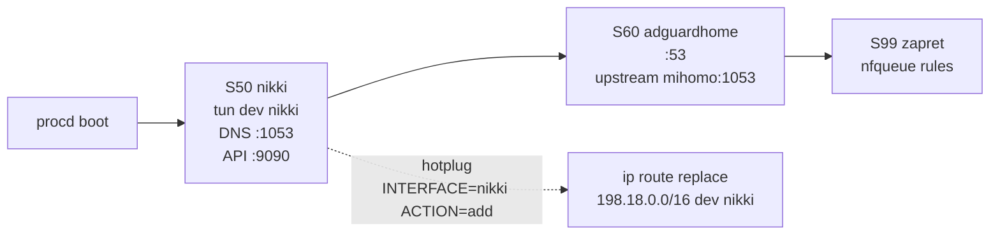
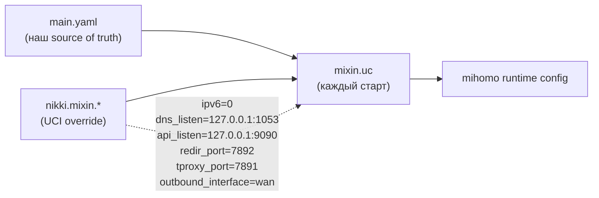

# Architecture

Технический референс трёх-слойного transparent gateway, который собирает
`install.sh`. Operator-facing usage — `README.md` / `README_RU.md`. Forward
plan — `ROADMAP.md`. Типовые сбои — `docs/TROUBLESHOOTING.md`.

Диаграммы ниже — Mermaid. GitHub / большинство IDE рендерят их инлайн.

---

## Слои



### Layer 1 — mihomo через nikki

- **Роль:** primary transport. Transparent proxy через VLESS+Reality.
- **DNS-режим:** fake-IP `198.18.0.0/16` для всего, что НЕ в `fake-ip-filter`.
  Fake-IP заворачивается в TUN, реальный адрес резолвится на VPS.
- **Listener'ы:** mixed `:7890`, DNS `:1053`, controller `:9090`,
  TProxy `:7891`, redir `:7892`. Все bind'ы на `127.0.0.1` (UCI mixin).
- **Mode:** `redir_tun` — TCP через TProxy, UDP через TUN (баланс CPU).
- **Profile:** `/etc/nikki/profiles/main.yaml` (0600).

### Layer 2 — zapret (NFQWS)

- **Роль:** DPI bypass для DIRECT-трафика, который иначе режет RU ISP
  (Google CDN, YouTube, Discord, Telegram CF-альт-порты).
- **Механизм:** nfqueue на egress, fragment / TLS-fake / hostfakesplit /
  fake-QUIC. Без туннеля.
- **Параллельно mihomo:** zapret действует ПОСЛЕ mihomo routing decision —
  только то, что mihomo не завернул в VLESS, попадает в DPI-bypass.
- **Config:** `/etc/config/zapret` + `/opt/zapret/config` (sync через
  `/opt/zapret/sync_config.sh` после UCI write).

### Layer 3 — AdGuard Home

- **Роль:** LAN-wide DNS-фильтр. Блок-листы, телеметрия, реклама.
- **Upstream:** mihomo `:1053` (fake-IP / nameserver-policy).
- **DoH-fallback:** `cloudflare-dns.com` (если mihomo не отвечает).
- **Bind:** `:53` LAN, web-wizard `:3000` (operator переносит на `:8080` +
  пароль после первого захода).
- **Config:** `/etc/adguardhome/adguardhome.yaml` (UCI `config_file`).

### Force-DNS firewall redirect

- **Роль:** ловить клиентов с хардкод `1.1.1.1:53` / `8.8.8.8:53`.
- **Механизм:** nftables DNAT в LAN-zone — `udp/tcp dport 53` → `LAN_IP:53`.
- **Лимит:** только `:53`. DoH (`:443` к `1.1.1.1`) и DoT (`:853`) проходят.
  Митигация — out of scope (см. `ROADMAP.md §Known limitations`).

### Port map

| Port | Listener | Bind |
|---|---|---|
| 53 (udp/tcp) | AdGuard Home | LAN |
| 54 (udp/tcp) | dnsmasq | 127.0.0.1 |
| 1053 (udp/tcp) | mihomo DNS | 127.0.0.1 |
| 3000 (tcp) | AGH wizard | LAN (move to 8080 после wizard) |
| 7890 (tcp) | mihomo mixed | 127.0.0.1 |
| 7891 (tcp) | mihomo TProxy | 127.0.0.1 |
| 7892 (tcp) | mihomo redir | 127.0.0.1 |
| 9090 (tcp) | mihomo controller | 127.0.0.1 |

---

## DNS resolution flow

Каждый L7-запрос клиента сначала проходит DNS. От того, что вернётся —
real-IP или fake-IP — зависит весь дальнейший роутинг.



**Зачем так сложно:**
- Fake-IP заставляет mihomo туннелировать запрос — обязательно для
  заблокированного в РФ трафика.
- Но для `.ru/.рф/.yandex.net` fake-IP ломает приложения (Smart TV апп
  Яндекс Станции, .ru сайты): они получали `198.18.x.x`, шли к нему как к
  реальному адресу, и mihomo направлял их по DIRECT-правилу — на 198.18 нет
  маршрута через WAN, TLS обрывался. Поэтому RU/Yandex домены принудительно
  получают real-IP через `nameserver-policy → Cloudflare DoH`.
- `www.youtube.com` тоже принудительно real-IP — нужен для прямого
  адресации DPI-bypass на конкретные YouTube IP-адреса, если приложение
  не уважает proxy hint.

---

## Routing rules (mihomo)

Порядок правил в `/etc/nikki/profiles/main.yaml` важен — первое совпадение
выигрывает.



**Ключевые design-решения:**

- **YOUTUBE и PROXY — Selector, не URL-test.** Юзер может вручную тогглить
  через mihomo UI (`http://router:9090/ui/`) или API; выбор кэшируется в
  `/etc/nikki/cache/cache.db` через рестарты.
- **YOUTUBE default = VLESS-REALITY.** RU ISP DPI режет TCP/443 к youtube.com.
  ПК-Chrome спасает QUIC fallback; Smart TV YT-app — TCP-only, виснет на
  TLS handshake. Поэтому первым в списке `[VLESS-REALITY, DIRECT]` стоит
  VLESS.
- **`ru-available-only-inside` ДО `.ru/GEOIP`.** Поймать `.net/.com`-домены
  русской инфры (Алиса/Станция через `.yandex.net`, Кинопоиск через
  `kinopoisk-ru.clstorage.net`) до фолбека по GEOIP.
- **`ru-blocked` ПОСЛЕ `.ru/GEOIP`.** Чтобы случайные RU-host-листы не
  утаскивали российский трафик в VLESS.
- **DIRECT через `wan`, не через TUN.** UCI `nikki.mixin.outbound_interface=
  'wan'` — без этого DIRECT-egress пытается идти через сам интерфейс
  `nikki` (ловушка `auto-detect-interface=false` в init.d), и mihomo
  логирует "reject loopback connection".

---

## NFQWS strategy (zapret)

Семь фильтр-секций, разделённых `--new`. UCI хранит `NFQWS_OPT`
single-line — `uci set` режет значение на первом `\n`, поэтому
`install.sh` собирает строку через инкрементальный concat.



**Ограничения procd argv parsing:**
- Combined-mode `--dpi-desync=fake,multisplit` режется на запятой → второй
  mode становится позиционным аргументом и игнорится. Поэтому каждая
  секция использует один mode.
- `--dpi-desync-fooling=badsum,badseq` — та же проблема. Используется
  один fooling per section.

**Tuning:** `/opt/zapret/blockcheck.sh` — официальный smoke-test (выбирает
параметры split/fooling per-site). Дописать домен в
`/opt/zapret/ipset/zapret-hosts-user.txt` для веток с user-list.

---

## Pipeline (16 шагов)



### Failure semantics

| Phase | Exit | Behavior |
|---|---|---|
| Steps 0-4 (preflight refuse) | **2** | No writes, no snapshot. Fix env, re-run. |
| Steps 5-15 (after snapshot, mutation failed) | **1** | Snapshot есть. Installer печатает `sh uninstall.sh` hint. **Auto-rollback'а нет.** |
| Step 16 (self-test FAIL) | **1** | State сохранён для диагностики. `uninstall.sh` для отката. |

**Идемпотентность:** `/etc/openwrt-setup-state` маркирует выполненные
шаги. Повторный запуск `install.sh` пропускает завершённые. `--force-config`
сбрасывает state и запускает pipeline целиком.

**Design:** нет `--force`, нет retry-loops, нет auto-rollback. Симметрия
обеспечена на уровне pipeline — `uninstall.sh` единственный путь отката.

---

## Service start order



**Crash semantics:**
- nikki down → AGH ходит в DoH-fallback, но fake-IP /16 не маршрутится →
  VLESS-routed сайты падают.
- AGH down → клиенты теряют DNS (Force-DNS отправляет на пустой `:53`);
  ручной фикс — выключить Force-DNS, рестартануть AGH.
- zapret down → деградируют только DPI-protected сервисы.

---

## UCI mixin: почему YAML-профиль недостаточен

`/etc/nikki/ucode/mixin.uc` мерджит `nikki.mixin.*` UCI поверх профиля
**на каждом старте**. Пакетные дефолты ломают нашу схему, поэтому
`install.sh` явно прибивает:



**Почему это критично:**
- Пакетный default `dns_listen='[::]:1053'` биндит dual-stack → UDP-ответы
  AGH теряются (TCP/1053 отвечает, UDP/1053 — i/o timeout 20s).
- Пакетный `api_listen='[::]:9090'` экспонит controller на v6.
- `redir_port`/`tproxy_port` у пакета своп'нуты относительно профиля.
- Без `outbound_interface=wan` DIRECT-egress зацикливается через сам TUN.

---

## Snapshot layout

Шаг 5, путь `/root/openwrt-mihomo-backup/` (mode 0700).

```
/root/openwrt-mihomo-backup/
├── snapshot.env          # KV оригинальных UCI значений
├── dhcp                  # /etc/config/dhcp до изменений
├── firewall              # /etc/config/firewall до изменений
├── network               # /etc/config/network до изменений
├── crontab.before        # root crontab на момент снапшота
├── packages.before       # opkg list-installed / apk info
└── installer.log         # timestamped action log
```

`snapshot.env` хранит оригинальные UCI для полей, которые installer
переписывает (`dhcp.@dnsmasq[0].port`, и т.п.). `uninstall.sh` читает
`snapshot.env` и применяет UCI символически (не blob-replace конфигов) —
edits оператора в несвязанных секциях сохраняются.

---

## Package manager detection

| OpenWrt | Detector | Manager |
|---|---|---|
| 24.10.x | `/etc/openwrt_release` = `24.10.*` + `/bin/opkg` | `opkg` |
| 25.04 / 25.12 | `/etc/openwrt_release` = `25.*` + `/usr/bin/apk` | `apk` |

Detection в preflight шаг 1. Installer отказывается, если ни один не
матчит. Релизы — `SUPPORTED_RELEASES` (env-override).

---

## Design invariants

- **POSIX sh only.** `#!/bin/sh`, без bash-расширений. Target — BusyBox ash.
- **`set -eu`** во всём `install.sh` и `uninstall.sh`. Без error-swallow.
- **Нет network-вызовов в preflight (шаги 0-3).**
- **Нет operator-prompts после шага 4.** Non-interactive падает на 4, если
  VLESS URL не задан, вместо блокировки в середине pipeline.
- **Все секрет-несущие файлы — `chmod 600` или `0700` dir** (UUID, Reality
  keys в `main.yaml`, snapshot dir).
- **Идемпотентность через step-state.** `/etc/openwrt-setup-state`
  маркирует завершённые шаги.
- **UCI single-line invariant.** Любое многострочное значение пишется
  через инкрементальный concat — `uci set` режет на первом `\n`.

---

## File layout после install

```
/etc/config/
├── nikki                # nikki UCI (profile, mode, mixin)
├── zapret               # zapret UCI (NFQWS_OPT, MODE_FILTER)
├── adguardhome          # AGH UCI (config_file, enabled)
├── dhcp                 # modified: @dnsmasq[0].port=54
├── firewall             # modified: +include Force-DNS DNAT
└── network              # обычно без изменений

/etc/nikki/profiles/main.yaml          # mihomo конфиг, 0600
/etc/nikki/run/{geosite,geoip}.dat     # pre-downloaded из runetfreedom
/etc/nikki/cache/cache.db              # selector-state mihomo, переживает рестарт
/etc/adguardhome/adguardhome.yaml      # AGH конфиг
/etc/hotplug.d/net/30-nikki-fakeip     # hot-add 198.18/16 → dev nikki
/opt/zapret/                           # zapret install tree
  ├── config                           # sync'ed from UCI
  ├── ipset/zapret-hosts-google.txt    # Google domains hostlist
  ├── ipset/zapret-hosts-user.txt      # user RU-blocked domains
  └── files/fake/{tls,quic}_*.bin      # fake clienthello payloads
/root/openwrt-mihomo-backup/           # snapshot (см. выше)
```

---

## Диагностика runtime

Канонический способ — mihomo HTTP API (см. `feedback_diagnose_mihomo_routing
_via_api` в memory):

```sh
SECRET=$(uci get nikki.mixin.api_secret)   # default: 132019

# Текущий selector группы
curl -s -H "Authorization: Bearer $SECRET" \
     http://127.0.0.1:9090/proxies/YOUTUBE | jq

# Соединения от конкретного клиента (фильтр по sourceIP)
curl -s -H "Authorization: Bearer $SECRET" \
     http://127.0.0.1:9090/connections | \
     jq '.connections[] | select(.metadata.sourceIP=="192.168.1.177")
       | {host: .metadata.host, chains, upload, download}'

# Hot-fix selector без рестарта
curl -X PUT -H "Authorization: Bearer $SECRET" \
     -H "Content-Type: application/json" \
     -d '{"name":"VLESS-REALITY"}' \
     http://127.0.0.1:9090/proxies/YOUTUBE
```

**Pattern для "X не работает у клиента Y":**
1. `/connections` → видеть `chains` и `download`.
2. Если `download=0` при `upload>0` и chains содержит DIRECT — selector
   группы и есть причина (DPI режет TCP/443).
3. Если chains правильный, но `download=0` — копать дальше: TLS pinning,
   IPv6 leak, app-кэш fake-IP.
